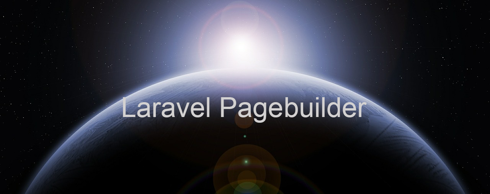

# Laravel-Pagebuilder




### Docs

* [Installation](#installation)
* [Configuration](#configuration)
* [Migrations](#migrations)
* [Seeds](#seeds)
* [Generators](#generators)
* [Usage](#usage)
* [Laravel compatibility](#laravel-compatibility)

## Installation

#### Install the package

```bash
composer require flobbos/laravel-pagebuilder
```
#### Install pagebuilder
Laravel 5.7+
```bash
php artisan pagebuilder:install 
```

This will run all migrations and trigger the seeder for the initial elements
and a language entry

## Configuration

The only thing in the config file is the classes you wish to use with Pagebuilder.

```php
'builder_classes' => [
        'article' => Flobbos\Pagebuilder\Models\Article::class,
    ]
```

Set additional classes that are supposed to run in a Pagebuilder controller. You can
generate multiple controllers for multiple resources using the Pagebuilder.

```php
$this->articles->setClass('article');
```

This setting in the generated controller will tell it which resource it needs to 
use for generating content.

## Generators

You can generate the controller and views for creating pagebuilder based resources
using the following generator commands:

```php
php artisan pagebuilder:controller ArticleController --route=pagebuilder.articles --views=pagebuilder.articles
```

This will generate a complete resource controller named ArticleController where the routes
and view calls are replaced with the values above. The views will always be prefixed with
vendor.

```php
php artisan pagebuilder:views vendor.pagebuilder.articles --route=pagebuilder.articles
```

Use the corresponding routes that you set with the controller and it will all work magically.

```php
pagebuilder:model Article
```

This will generate a Post model that extends the Article model that comes with
the package so all necessary relationships and translation options are included. 
This step is only needed if your base model needs additional fields that don't 
come with the Article model. 

## JS Components

To use the pagebuilder you need to install its VueJS counterpart by running:

```bash
npm install @chrisbielak/vue-pagebuilder
```

All the needed documentation can be found here: 
[Vue Pagebuilder](https://www.npmjs.com/package/@chrisbielak/vue-pagebuilder "Google's Homepage")

## Laravel compatibility

 Laravel  | Crudable
:---------|:----------
 6.0      | >1.0.0
 5.8      | >1.0.0
 5.7      | >1.0.0


